[English](README.en.md) | **简体中文**

<picture>
  <source media="(max-width: 640px) and (prefers-color-scheme: dark)" srcset="assets/presentation/hero-mobile-dark.svg">
  <source media="(max-width: 640px)" srcset="assets/presentation/hero-mobile-light.svg">
  <source media="(prefers-color-scheme: dark)" srcset="assets/presentation/hero-dark.svg">
  
</picture>

**把 KV 张量、块映射与架构信息保存为磁盘快照，在恢复前校验内容。**

`v0.1.0` · `Python 3.12+ / PyTorch` · [MIT](LICENSE)

[Website](https://kvsnap.lei6393.com) · [Demo record](docs/demo-results.json)

## 为什么使用

缓存状态只有在进程内时，难以独立检查它保存了哪些张量、是否损坏、能否读回。KVSnap 把这些信息组成一个自描述目录，用 manifest 描述 blob，并提供保存、校验和恢复接口。

## 架构

<picture>
  <source media="(max-width: 640px) and (prefers-color-scheme: dark)" srcset="assets/presentation/architecture-mobile-dark.svg">
  <source media="(max-width: 640px)" srcset="assets/presentation/architecture-mobile-light.svg">
  <source media="(prefers-color-scheme: dark)" srcset="assets/presentation/architecture-dark.svg">
  
</picture>

KVCacheBackend 暴露 extract/inject。checkpoint 写入 manifest、逐层 K/V blob 与 block_map；verify 重算 xxhash64；restore 验证后读回张量并注入后端。InMemoryBackend 支持 CPU 往返验证，VLLMBackend 直接依赖特定引擎内部属性，接入需要单独验证。

源码入口：[kvsnap/backend_vllm.py](kvsnap/backend_vllm.py) · [kvsnap/checkpoint.py](kvsnap/checkpoint.py) · [kvsnap/storage.py](kvsnap/storage.py) · [kvsnap/verify.py](kvsnap/verify.py) · [kvsnap/restore.py](kvsnap/restore.py) · [kvsnap/serve.py](kvsnap/serve.py) · [kvsnap/config.py](kvsnap/config.py)

## 安装

需要 Python 3.12+、uv 和 PyTorch。源码默认安装即可运行 CPU 示例；实际 vLLM 接入另需对应引擎与硬件环境。

```bash
git clone https://github.com/SuperMarioYL/kvsnap.git
cd kvsnap
uv venv --python 3.12
uv pip install --python .venv/bin/python -e .
```

## 快速开始

以 seed=42 创建小型合成 CPU KV 张量，走真实磁盘格式与校验路径，再恢复到新后端并逐张量比较。没有运行模型、GPU 或百万 token 上下文。

```bash
.venv/bin/python examples/presentation-demo.py
```

完整输入与执行步骤见上方命令及 [Demo 记录](docs/demo-results.json)。

## 使用

```bash
.venv/bin/kvsnap save --mock --layers 2 --blocks 3
.venv/bin/kvsnap list
.venv/bin/kvsnap info --session default
.venv/bin/kvsnap verify
.venv/bin/kvsnap restore --mock
```
Python 接入可参考 [round_trip.py](examples/round_trip.py)。在实际服务中，应在安全的一致性边界调用 checkpoint.save，再将恢复操作接到已分配兼容缓存的引擎；保存了张量不等于已经恢复调度器请求生命周期。

## 实际 Demo

<picture>
  <source media="(max-width: 640px) and (prefers-color-scheme: dark)" srcset="assets/presentation/process-mobile-dark.svg">
  <source media="(max-width: 640px)" srcset="assets/presentation/process-mobile-light.svg">
  <source media="(prefers-color-scheme: dark)" srcset="assets/presentation/process-dark.svg">
  
</picture>

### 保存、校验并读回

两层、三个块，共五个 blob；K/V 与块映射全部相等。

```text
$ .venv/bin/python examples/presentation-demo.py
{
  "backend": "CPU InMemoryBackend",
  "layers": 2,
  "blocks": 3,
  "verified_blobs": 5,
  "tensors_equal": true,
  "block_map_equal": true
}
```

## 能力与接入

<picture>
  <source media="(max-width: 640px) and (prefers-color-scheme: dark)" srcset="assets/presentation/integrations-mobile-dark.svg">
  <source media="(max-width: 640px)" srcset="assets/presentation/integrations-mobile-light.svg">
  <source media="(prefers-color-scheme: dark)" srcset="assets/presentation/integrations-dark.svg">
  
</picture>

CLI 的 list/info/verify 面向磁盘目录。save --mock 和 restore --mock 用于 CPU 示例；程序 API 可嵌入服务进程。serve 包装提供 SIGUSR1 保存与启动恢复入口，但不能从 CPU 演示推导其在任意模型或硬件上的可用性。


## 配置

默认目录为 `.kvsnap`，默认会话名为 default。manifest 记录模型 ID、层数、KV 头数、head_dim、dtype、块数、序列长度、前缀哈希以及每个 blob 的形状和 xxhash64。`config.py` 定义格式与 vLLM 目标版本。xxhash 用于内容校验，不是签名或加密。

## 路线图与范围

当前已验证 CPU 序列化与恢复。真实引擎请求状态恢复、跨版本兼容、更多硬件、多节点同步与自动调度需要后续验证或实现。

- 未验证 GLM、昇腾、海光或特定 vLLM 版本；不声称秒级恢复或免除某个规模的 prefill。
- 当前适配器使用内部属性与部分推断状态；投入真实服务前必须检查调度器、前缀和块表契约。

 · [Recording script](docs/demo.tape)

## 许可证

[MIT](LICENSE)
