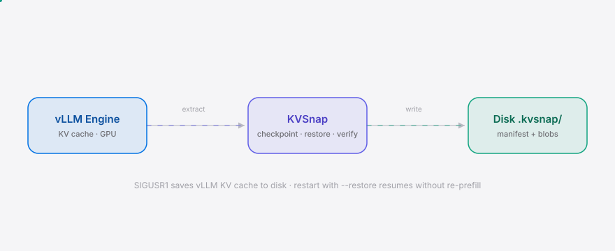
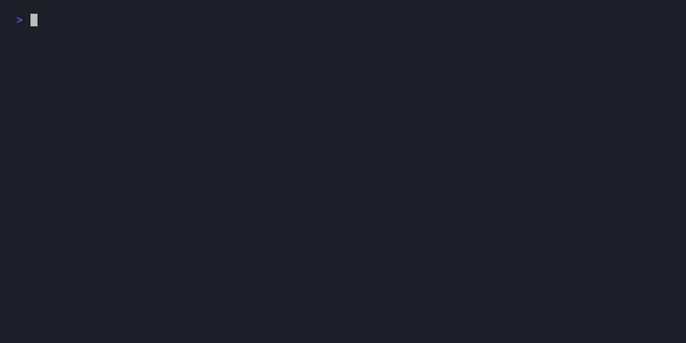

<div align="right"><sub>[English](./README.en.md) | <b>简体中文</b></sub></div>

<picture>
  <source media="(prefers-color-scheme: dark)" srcset="./assets/hero-dark.svg">
  <source media="(prefers-color-scheme: light)" srcset="./assets/hero-light.svg">
  
</picture>

<p align="center"><sub>为信创气隙运营商持久化并恢复 GLM-5.3 的百万 token KV 缓存——重启即恢复，无需重算 prefill。</sub></p>

<p align="center"><strong>信创气隙下 GLM-5.3 重启即丢百万 token KV 缓存？KVSnap 落盘保存、秒级恢复，免除数小时 prefill 重算。</strong></p>

<p align="center">
  <a href="./LICENSE"></a>
  <a href="https://github.com/SuperMarioYL/kvsnap/releases"></a>
  <a href="https://github.com/SuperMarioYL/kvsnap/actions/workflows/test.yml"></a>
  
  
</p>

<h2> 架构</h2>

<picture>
  <source media="(prefers-color-scheme: dark)" srcset="./assets/atlas-dark.svg">
  <source media="(prefers-color-scheme: light)" srcset="./assets/atlas-light.svg">
  
</picture>

KVSnap 以**单进程**方式运行在 vLLM 进程内部，直接经 Python 读取引擎的分页 KV 缓存张量与 block 管理器状态，序列化为自描述的磁盘检查点；重启后按同一格式注入新引擎，跳过整段 prefill。无微服务、无独立守护进程。CLI（`list` / `info` / `verify`）只对磁盘检查点目录操作，不触碰 GPU。

<h2> 工作原理</h2>

**为什么需要。** 信创气隙环境下，运营商以 GLM-5.3 跑百万 token 上下文的智能体：一次维护、驱动升级或进程崩溃，就会丢掉累积的 80GB+ 注意力状态。气隙下没有云可回退，vLLM 不会为该模型把 KV 缓存序列化到磁盘，而在国产 GPU（昇腾 910 / 海光 DCU）上重算 1M token 的 prefill 要数十分钟到数小时。KVSnap 把"重启即丢全部上下文"变成"重启即恢复"。

**核心原语**——一个可移植、自描述的 KV 缓存检查点格式（vLLM、LMCache 或任何现有工具都不曾把它作为跨重启的磁盘产物暴露出来）：

```
.kvsnap/<session>/
  manifest.yaml      # magic=KVS1 + 架构指纹 + blob 清单 (xxhash64)
  layer_0_k.bin      # 第 0 层 K 张量原始字节 (bfloat16 可无损往返)
  layer_0_v.bin      # 第 0 层 V 张量原始字节
  ...
  block_map.bin      # block 管理器状态 (token→block 映射, int64)
```

`manifest.yaml` 记录模型架构指纹（层数 / KV 头数 / head_dim / dtype / 总 block 数）、序列长度、token 前缀的 xxhash64、以及每个 blob 的形状、字节长度与 xxhash64。`restore` 在注入前先比对架构指纹——模型 wheel 升级后不会静默错位。`verify` 重算每个 blob 的 xxhash64，磁盘错误或被篡改的 blob 在进引擎前就被拦下。

<h2> 安装</h2>

```bash
pip install kvsnap
```

生产环境需要 vLLM（按 [target vLLM 0.6.x](https://github.com/vllm-project/vllm)）：

```bash
pip install 'kvsnap[vllm]'
```

> 信创气隙机房无公网时，可离线 `wheel` 安装：`pip install --no-index --find-links=./wheels kvsnap`。

<h2> 快速开始</h2>

三条命令、离线即可验证整个落盘→校验→恢复链路（`--mock` 用假 KV 缓存，无需 GPU / vLLM）：

```bash
kvsnap save --mock --layers 3 --blocks 8     # 落盘一个检查点到 ./.kvsnap/default/
kvsnap verify                                 # 重算每个 blob 的 xxhash64
kvsnap restore --mock                         # 注入新后端，张量逐字节一致
```

<details><summary>sample output</summary>

```
✓ saved session default -> .kvsnap/default
  model=glm-5.3-1m  layers=3  kv_heads=8  head_dim=128
  seq_len=128  blocks=8  dtype=bfloat16  on_disk=1.05 MB
✓ default: verified 7 blobs, all hashes match
✓ restored session default (3 layers, 8 blocks, 128 tokens) — verified 7 blobs
```
</details>

<h2> 用法</h2>

生产环境的完整快乐路径——用 `kvsnap` 取代裸 `vllm serve`：

```bash
# 1. 用 kvsnap 启动 vLLM（SIGUSR1 落盘钩子已武装）
python -m kvsnap.serve --model glm-5.3-1m

# 2. 维护前发 SIGUSR1，进程同步落盘到 ./.kvsnap/default/
kill -USR1 <pid>

# 3. 重启并恢复，跳过数小时 prefill，上下文完整
python -m kvsnap.serve --model glm-5.3-1m --restore default
```

磁盘检查点巡检（不依赖运行中的引擎，任意机器可跑）：

```bash
kvsnap list                      # 列出所有会话
kvsnap info --session default    # 查看 manifest：架构指纹 + blob 清单
kvsnap verify                    # 完整性校验（篡改/撕裂即报错）
```

更多示例见 [`examples/`](./examples)。

<h2> Demo</h2>

<p align="center"></p>

<p align="center"><sub>离线 <code>--mock</code> 路径（无需 GPU）。生产路径用 <code>kill -USR1</code> 落盘、<code>--restore</code> 恢复。</sub></p>

<h2> 企业版</h2>

OSS 核心模块（`save` / `restore` / `verify`）永久免费、MIT 协议。企业版面向信创 / 国资运营商，按部署站点授权：

| 能力 | OSS | 企业版 |
|---|:---:|:---:|
| 单机落盘 / 恢复 / 校验 | ✓ | ✓ |
| 多节点缓存同步（气隙集群分发同一检查点） | — | ✓ |
| 信创审计日志（数据操作可追溯） | — | ✓ |
| 昇腾 910 / 海光 DCU GPU 适配 | — | ✓ |
| 现场 integration 与培训 | — | ✓ |

定价：**¥50,000–200,000 / 年 / 站点**。单站点年度授权含邮件 + 企业微信支持；¥200,000 为多站点 + 现场 integration + 优先响应。轻量入门可走 **¥5,000 / 月** 支持套餐（企业微信 / 支付宝企业支付）再决定年度合同。

结算走**对公转账 + 增值税专用发票**（信创 / 国资客户需正式合同、发票、对公付款，不接受信用卡或 Stripe）。试用流程：OSS 在气隙机房验证可用 → 命中多节点 / 审计需求 → 联系企业微信群或 README 中的邮箱 → 30 天企业 trial → 集群验证 → 报价 → 签合同 → 开票。联系我们请开 [issue](https://github.com/SuperMarioYL/kvsnap/issues) 标注 `enterprise`。

<h2> 常见问题</h2>

**vLLM 不是已经有 prefix caching 了吗？** prefix caching 是跨请求的内存复用，不跨重启、不落盘。KVSnap 解决的是进程重启后的磁盘恢复——完全不同的问题。

**为什么不直接重新送一遍 context？** 1M token 的 prefill 在信创硬件（昇腾 910）上要数十分钟到数小时。KVSnap 把恢复压到秒级。

**LMCache 不是已经做 KV cache 管理了吗？** LMCache 做的是跨请求的 KV cache 内存共享（serving 优化），不跨重启落盘，不针对信创气隙场景。KVSnap 是磁盘持久化 + 重启恢复。

**这个会不会被 vLLM 吸收？** 可能。但信创场景的审计合规、国产 GPU 适配是上游不会优先做的——这是 KVSnap 的差异化。

**为什么不直接用文件存 KV cache？** KV cache 是 GPU 上的 paged tensor，需要理解 vLLM 的 block manager 才能正确序列化和恢复——不是简单的文件 I/O。KVSnap 把张量、block 映射、架构指纹和 xxhash64 校验一起打包成自描述格式。

**`save` 能直接当 CLI 命令用吗？** 生产 `save` 在进程内经 SIGUSR1 触发（`kill -USR1 <pid>`），不是独立 CLI。`kvsnap save --mock` 仅用于离线验证格式与演示。

<h2> 路线图</h2>

- [x] **m1 — 序列化**：经 vLLM 后端抽取 KV 缓存张量，落盘为自描述检查点（manifest + blobs + block_map）
- [x] **m2 — 恢复**：从磁盘读回并注入新引擎，save→kill→restart→restore 张量逐字节一致，证明是恢复而非重算
- [x] **m3 — 校验 + serve 包装**：xxhash64/blob 完整性校验、`kvsnap serve`（SIGUSR1 落盘 + `--restore` 自启）、CLI 打磨、双语 README
- [ ] **v0.2** — 多模型支持（Qwen3-Plus、DeepSeek-V3）、昇腾 / 海光 GPU 适配、多节点缓存同步、信创审计日志、自动检查点调度

<h2> 分享</h2>

```
KVSnap — 信创气隙下 GLM-5.3 的 1M KV 缓存落盘恢复工具。重启即丢全部上下文？SIGUSR1 落盘、秒级恢复，跳过数小时 prefill。https://github.com/SuperMarioYL/kvsnap
```

<h2> 贡献</h2>

欢迎 issue 与 PR：在 [Issues](https://github.com/SuperMarioYL/kvsnap/issues) 报 bug 或提需求，按 [test.yml](./.github/workflows/test.yml) 跑通测试即可提 PR。企业版 / 信创适配需求请开 issue 标注 `enterprise`。Gitee 镜像面向信创采购受众。

<p align="center"><sub><a href="./LICENSE">MIT</a> © 2026 SuperMarioYL</sub></p>
